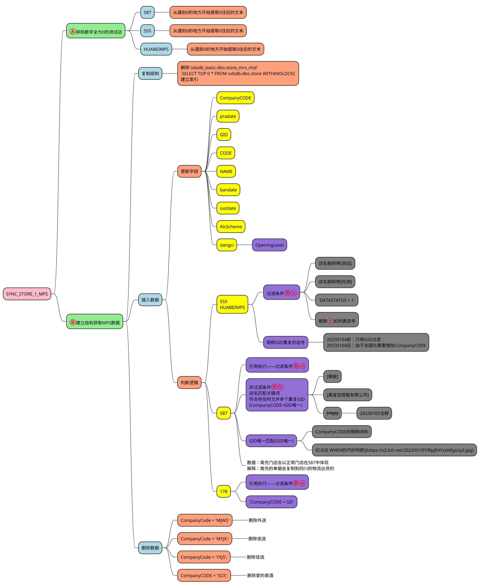

---
{"dg-publish":true,"permalink":"/(2_021)(算法解析)/√(20220405)-(过程解析)-(061)-(基础)-(SYNC_STORE_1_MPS)/"}
---


# <font color=#DC143C>(20220405)-(过程解析)-(061)-(基础)-(SYNC_STORE_1_MPS)</font>
URL:: 

```
dataview
table 萃取重点, 萃取难点, 萃取锚点, 萃取输出
where contains(TITLES, "")
```

```toc
```

```ad-summary
1. 具体操作:抓取后缀连续为零的门店(疑似测试店)
    1. 数据来源:`DATABASE_5_87.MStore.dbo.STORE`
    2. 数据来源:`DATABASE_5_55.MStore.dbo.STORE`
2. 具体操作:复制店表结构
    1. 数据来源:odsdbfq.dbo.store
    2. 处理结果:odsdbfq.dbo.store_mrx_mid
3. 具体操作:插入数据
```

## (20230109)-(结构思维)


+ CASE WHEN的巧妙判断
    + 

<hr style="border:3px solid ForestGreen"> </hr>

## [XSYNC_STORE_1_MPS|20230109]-[061]-[全国]
```SQL
USE [odsdb_basic]
GO
/****** Object:  StoredProcedure [dbo].[XSYNC_STORE_1_MPS]    Script Date: 2023/1/9 15:04:54 ******/
SET ANSI_NULLS ON
GO
SET QUOTED_IDENTIFIER ON
GO
ALTER PROC [dbo].[XSYNC_STORE_1_MPS]
AS
BEGIN
SET NOCOUNT ON
--*******************************************************************************************************************************************************************
--属服务器:[192.168.0.61]
--属数据库:[odsdb_basic]
--提出人员:周焕焕
--创建人员:徐海权
--创建时间:20220405
--创建用途:店表更新单元化分拆
--修改时间:20221216
--修改内容:增加[经营档次]字段的获取
--修改时间:徐海权(20220907)
--修改内容:增加HUABEIMPS链接
--修改时间:徐海权(20220919)
--修改内容:省份代码MJWS变更为YXJS(只更换CompanyCODE)
--修改时间:徐海权(20221219)
--修改内容:删除爱的是酒
--重构时间:20230107
--重构内容:全国统一更新过程
--更新频率:每日
--修改人员:
--报表维度:
--相关过程:
--生成结果:odsdb_basic.dbo.store_mrx_mid
--*******************************************************************************************************************************************************************
--↹↹↹↹↹↹↹↹↹↹↹↹↹↹↹↹↹↹↹↹↹↹↹↹↹↹↹↹↹↹↹↹↹↹↹↹↹↹↹↹↹↹↹↹↹↹[排除数字全为0的测试店]
--⇶⇶⇶⇶⇶⇶⇶⇶⇶⇶⇶⇶⇶[DATABASE_5_87]
IF OBJECT_ID('odsdb_basic.dbo.textStore', 'U') IS NOT NULL DROP TABLE odsdb_basic.dbo.textStore;
SELECT CompanyCODE, GID, CODE
INTO odsdb_basic.dbo.textStore
FROM DATABASE_5_87.MStore.dbo.STORE WITH(NOLOCK)--587
WHERE (CASE SUBSTRING(CODE, CHARINDEX('0', CODE, 1), LEN(CODE) - CHARINDEX('0', CODE, 1) + 1)
       WHEN '000' THEN 1
       WHEN '0000' THEN 1
       WHEN '00000' THEN 1
       WHEN '000000' THEN 1
       WHEN '0000000' THEN 1
       ELSE 0 END = 1)
--⇶⇶⇶⇶⇶⇶⇶⇶⇶⇶⇶⇶⇶[DATABASE_5_55]
INSERT INTO odsdb_basic.dbo.textStore(CompanyCODE, GID, CODE)
SELECT a.CompanyCODE, a.GID, a.CODE
FROM DATABASE_5_55.MStore.dbo.STORE AS a WITH(NOLOCK)--555
WHERE (CASE SUBSTRING(a.CODE, CHARINDEX('0', a.CODE, 1), LEN(a.CODE) - CHARINDEX('0', a.CODE, 1) + 1)
       WHEN '000' THEN 1
       WHEN '0000' THEN 1
       WHEN '00000' THEN 1
       WHEN '000000' THEN 1
       WHEN '0000000' THEN 1
       ELSE 0 END = 1)
AND NOT EXISTS(SELECT * FROM odsdb_basic.dbo.textStore AS b WITH(NOLOCK) WHERE a.gid = b.gid AND a.CompanyCODE = b.CompanyCODE)
--⇶⇶⇶⇶⇶⇶⇶⇶⇶⇶⇶⇶⇶[HUABEIMPS]
INSERT INTO odsdb_basic.dbo.textStore(CompanyCODE, GID, CODE)
SELECT a.CompanyCODE, a.GID, a.CODE
FROM HUABEIMPS.MStore.dbo.STORE AS a WITH(NOLOCK)--HUABEIMPS
WHERE (CASE SUBSTRING(a.CODE, CHARINDEX('0', a.CODE, 1), LEN(a.CODE) - CHARINDEX('0', a.CODE, 1) + 1)
       WHEN '000' THEN 1
       WHEN '0000' THEN 1
       WHEN '00000' THEN 1
       WHEN '000000' THEN 1
       WHEN '0000000' THEN 1
       ELSE 0 END = 1)
AND NOT EXISTS(SELECT * FROM odsdb_basic.dbo.textStore AS b WITH(NOLOCK) WHERE a.gid = b.gid AND a.CompanyCODE = b.CompanyCODE)
--↹↹↹↹↹↹↹↹↹↹↹↹↹↹↹↹↹↹↹↹↹↹↹↹↹↹↹↹↹↹↹↹↹↹↹↹↹↹↹↹↹↹↹↹↹↹[建立结构|获取MPS数据]
--⇶⇶⇶⇶⇶⇶⇶⇶⇶⇶⇶⇶⇶[复制结构]
IF OBJECT_ID('odsdb_basic.dbo.store_mrx_mid', 'U') IS NOT NULL DROP TABLE odsdb_basic.dbo.store_mrx_mid;
SELECT TOP 0 *
INTO odsdb_basic.dbo.store_mrx_mid
FROM odsdb.dbo.store WITH(NOLOCK);
/*INDEX*/
CREATE CLUSTERED INDEX IDX_CL_CODE ON odsdb_basic.dbo.store_mrx_mid(CODE);
CREATE NONCLUSTERED INDEX IDX_GID ON odsdb_basic.dbo.store_mrx_mid(GID);
CREATE NONCLUSTERED INDEX IDX_CompanyCODE ON odsdb_basic.dbo.store_mrx_mid(CompanyCODE);
--⇶⇶⇶⇶⇶⇶⇶⇶⇶⇶⇶⇶⇶[DATABASE_5_55/*插入数据*/]
INSERT INTO store_mrx_mid(CompanyCODE, Province, pradate, GID, CODE, NAME, ADDRESS, AREA, PERIOD1, PERIOD2, PERIOD3, GUIDANCER,
                          MENTOR, MANAGER, dbusername, BANK, property, idcard, path3, phone4, zhiyedancer, shopman, payno,
                          payno1, payhigh, paylow, svrname, phone3, phone, bandate, outdate, path1, phone1, period4, AlcScheme,
                          CONTACTOR, SYSPATH, SysArea, dangci)
SELECT CompanyCODE, '' province, pradate, GID, CODE, NAME, ADDRESS, ISNULL(AREA, '') AREA, period1, period2, period3,
       guidancer, '' MENTOR, manager, DBUSERNAME, bank, ISNULL(PROPERTY, '') property, IDCARD, path3, phone4,
       zhiyedancer, shopman, payno, payno1, ISNULL(payhigh, ''), ISNULL(paylow, '') paylow, SVRNAME, phone3, PHONE,
       BANDATE, OUTDATE, PATH1, phone1, period4, AlcScheme,CONTACTOR, SYSPATH, SysArea,
       CASE WHEN LEN(OpeningLevel) = 0 THEN NULL ELSE OpeningLevel END AS dangci
FROM DATABASE_5_55.MStore.dbo.STORE WITH(NOLOCK)
WHERE CompanyCODE <> 'gd'
AND NAME NOT LIKE '%测试%'
AND NAME NOT LIKE '%内测%'
AND CODE NOT IN('1002')/*2020-01-04脏数据[四川南充美宜佳]*/
AND DATASTATUS = 1/*2021-10-30:共配省份独立切换提前准备资料导致重复*/
AND NOT EXISTS(SELECT * FROM odsdb_basic.dbo.textStore AS a WITH(NOLOCK) WHERE a.GID = STORE.GID AND a.CompanyCODE = STORE.CompanyCODE)
AND NOT EXISTS(SELECT * FROM store_mrx_mid AS a WITH(NOLOCK) WHERE a.gid = store.gid AND /*20230104增加条件*/ a.CompanyCODE = STORE.CompanyCODE)
--⇶⇶⇶⇶⇶⇶⇶⇶⇶⇶⇶⇶⇶[HUABEIMPS/*插入数据*/]
INSERT INTO store_mrx_mid(CompanyCODE, Province, pradate, GID, CODE, NAME, ADDRESS, AREA, PERIOD1, PERIOD2, PERIOD3, GUIDANCER,
                          MENTOR, MANAGER, dbusername, BANK, property, idcard, path3, phone4, zhiyedancer, shopman, payno,
                          payno1, payhigh, paylow, svrname, phone3, phone, bandate, outdate, path1, phone1, period4, AlcScheme,
                          CONTACTOR, SYSPATH, SysArea, dangci)
SELECT CompanyCODE, '' province, pradate, GID, CODE, NAME, ADDRESS, ISNULL(AREA, '') AREA, period1, period2, period3,
       guidancer, '' MENTOR, manager, DBUSERNAME, bank, ISNULL(PROPERTY, '') property, IDCARD, path3, phone4,
       zhiyedancer, shopman, payno, payno1, ISNULL(payhigh, ''), ISNULL(paylow, '') paylow, SVRNAME, phone3, PHONE,
       BANDATE, OUTDATE, PATH1, phone1, period4, AlcScheme, CONTACTOR, SYSPATH, SysArea,
       CASE WHEN LEN(OpeningLevel) = 0 THEN NULL ELSE OpeningLevel END AS dangci
FROM HUABEIMPS.MStore.dbo.STORE WITH(NOLOCK)
WHERE CompanyCODE <> 'gd'
AND NAME NOT LIKE '%测试%'
AND NAME NOT LIKE '%内测%'
AND DATASTATUS = 1/*2021-10-30:共配省份独立切换提前准备资料导致重复*/
AND NOT EXISTS(SELECT * FROM odsdb_basic.dbo.textStore AS a WITH(NOLOCK) WHERE a.GID = STORE.GID AND a.CompanyCODE = STORE.CompanyCODE)
AND NOT EXISTS(SELECT * FROM store_mrx_mid AS a WITH(NOLOCK) WHERE a.gid = store.gid AND /*20230104增加条件*/ a.CompanyCODE = STORE.CompanyCODE)
--⇶⇶⇶⇶⇶⇶⇶⇶⇶⇶⇶⇶⇶[DATABASE_5_87/*插入数据*/]
INSERT INTO store_mrx_mid(CompanyCODE, Province, pradate, GID, CODE, NAME, ADDRESS, AREA, PERIOD1, PERIOD2, PERIOD3, GUIDANCER,
                          MENTOR, MANAGER, dbusername, BANK, property, idcard, path3, phone4, zhiyedancer, shopman, payno,
                          payno1, payhigh, paylow, svrname, phone3, phone, bandate, outdate, path1, phone1, period4, AlcScheme,
                          CONTACTOR, SYSPATH, SysArea, dangci)
SELECT CompanyCODE, '' province, pradate, GID, CODE, NAME, ADDRESS, ISNULL(AREA, '') AREA, period1, period2, period3,
       guidancer, '' MENTOR, manager, DBUSERNAME, bank, ISNULL(PROPERTY, '') property, IDCARD, path3, phone4,
       zhiyedancer, shopman, payno, payno1, ISNULL(payhigh, ''), ISNULL(paylow, '') paylow, SVRNAME, phone3, PHONE,
       BANDATE, OUTDATE, PATH1, phone1, period4, AlcScheme, CONTACTOR, SYSPATH, SysArea,
       CASE WHEN LEN(OpeningLevel) = 0 THEN NULL ELSE OpeningLevel END AS dangci
FROM DATABASE_5_87.MStore.dbo.STORE WITH(NOLOCK)
WHERE CompanyCODE <> 'gd'
AND NAME NOT LIKE '%测试%'
AND NAME NOT LIKE '%内测%'
AND DataStatus = 1/*2021-10-30:共配省份独立切换提前准备资料导致重复*/
AND CODE NOT IN('1002')/*2020-01-04脏数据[四川南充美宜佳]*/
AND NOT EXISTS(SELECT * FROM odsdb_basic.dbo.textStore AS b WITH(NOLOCK) WHERE b.GID = STORE.GID AND b.CompanyCODE = STORE.CompanyCODE)
AND NOT EXISTS(SELECT * FROM store_mrx_mid AS c WITH(NOLOCK)
               WHERE c.GID = STORE.GID
               AND c.CompanyCODE = (CASE WHEN STORE.[name] LIKE '%模板%' THEN STORE.CompanyCODE
                                         WHEN STORE.[name] LIKE '%美宜佳控股有限公司%' THEN STORE.CompanyCODE
                                         --WHEN STORE.CompanyCODE = 'YXJS' THEN STORE.CompanyCODE
                                         ELSE c.CompanyCODE END))
--⇶⇶⇶⇶⇶⇶⇶⇶⇶⇶⇶⇶⇶[DATABASE_178|插入数据]
INSERT INTO store_mrx_mid(CompanyCODE, Province, pradate, GID, CODE, NAME, ADDRESS, AREA, PERIOD1, PERIOD2, PERIOD3, GUIDANCER,
                          MENTOR, MANAGER, dbusername, BANK, property, idcard, path3, phone4, zhiyedancer, shopman, payno,
                          payno1, payhigh, paylow, svrname, phone3, phone, bandate, outdate, path1, phone1, period4, AlcScheme,
                          CONTACTOR, SYSPATH, SysArea, dangci)
SELECT CompanyCODE, '' province, pradate, GID, CODE, NAME, ADDRESS, ISNULL(AREA, '') AREA, period1, period2, period3, guidancer,
       ''         MENTOR, manager, DBUSERNAME, bank, ISNULL(PROPERTY, '') property, IDCARD, path3, phone4, zhiyedancer, shopman, payno,
       payno1, ISNULL(payhigh, ''), ISNULL(paylow, '') paylow, SVRNAME, phone3, PHONE, BANDATE, OUTDATE, PATH1, phone1, period4,
       AlcScheme, CONTACTOR, SYSPATH, SysArea,
       CASE WHEN LEN(OpeningLevel) = 0 THEN NULL ELSE OpeningLevel END AS dangci
FROM DATABASE_178.MStore.dbo.STORE WITH(NOLOCK)
WHERE CompanyCODE = 'GD'
--AND NAME NOT LIKE '%测试%'/*排除测试门店*/--20221130-徐海权-注释
--AND NAME NOT LIKE '%内测%'/*排除测试门店*/--20221130-徐海权-注释
AND DataStatus = 1/*2021-10-30:共配省份独立切换提前准备资料导致重复*/
AND CODE NOT IN ('TEST', 'SB2B')
AND CODE NOT LIKE 'x%'/*湖南*/
AND CODE NOT LIKE 'f%'/*福建*/
AND CODE != '0198';
--⇶⇶⇶⇶⇶⇶⇶⇶⇶⇶⇶⇶⇶[调试|检查剔除门店]
--SELECT *
--FROM DATABASE_178.MStore.dbo.STORE WITH(NOLOCK)
--WHERE NOT EXISTS(SELECT * FROM store_mrx_mid WITH(NOLOCK)
--                 WHERE store_mrx_mid.CompanyCode = store.CompanyCode
--                 AND   store_mrx_mid.gid = store.gid)
--AND DataStatus = 1
--ORDER BY CompanyCode;
--↹↹↹↹↹↹↹↹↹↹↹↹↹↹↹↹↹↹↹↹↹↹↹↹↹↹↹↹↹↹↹↹↹↹↹↹↹↹↹↹↹↹↹↹↹↹[特殊删除]
DELETE FROM store_mrx_mid WHERE CompanyCode = 'MJWS';
DELETE FROM store_mrx_mid WHERE CompanyCode = 'MYJX';
DELETE FROM store_mrx_mid WHERE CompanyCode = 'YXJS';
DELETE FROM store_mrx_mid WHERE CompanyCODE = 'SCX';
--*******************************************************************************************************************************************************************
SET NOCOUNT OFF
END
```

<hr style="border:3px solid ForestGreen"> </hr>

## [SYNC_STORE_1_MPS|20211127]-[061]-[分区]
### 版本1
```SQL
USE [odsdbfq]
GO
/****** Object:StoredProcedure [dbo].[SYNC_STORE_1_MPS]    Script Date:2019-04-22 15:44:53 ******/
SET ANSI_NULLS ON
GO
SET QUOTED_IDENTIFIER ON
GO
CREATE PROC [dbo].[SYNC_STORE_1_MPS]
AS
BEGIN
SET NOCOUNT ON
--*******************************************************************************************************************************************************************
--属服务器:[192.168.0.61]
--属数据库:[odsdbfq]
--提出人员:周焕焕
--创建人员:徐海权
--创建时间:20211125
--创建用途:店表更新单元化分拆
--更新频率:每日
--修改人员:
--报表维度:
--相关过程:
--生成结果:odsdbfq.dbo.store_mrx_mid
--*******************************************************************************************************************************************************************
--↹↹↹↹↹↹↹↹↹↹↹↹↹↹↹↹↹↹↹↹↹↹↹↹↹↹↹↹↹↹↹↹↹↹↹↹↹↹↹↹↹↹↹↹↹↹[排除数字全为0的测试店]
--⇶⇶⇶⇶⇶⇶⇶⇶⇶⇶⇶⇶⇶[DATABASE_5_87]
IF OBJECT_ID('tempdb.dbo.#textStore', 'U') IS NOT NULL DROP TABLE #textStore;
SELECT CompanyCode, GID, code
INTO #textStore
FROM DATABASE_5_87.MStore.dbo.STORE WITH(NOLOCK)
WHERE (CASE SUBSTRING(code, CHARINDEX('0', code, 1), LEN(code) - CHARINDEX('0', code, 1) + 1)
       WHEN '000' THEN 1
       WHEN '0000' THEN 1
       WHEN '00000' THEN 1
       ELSE 0 END = 1)
--⇶⇶⇶⇶⇶⇶⇶⇶⇶⇶⇶⇶⇶[DATABASE_5_55]
INSERT INTO #textStore(CompanyCode, GID, code)
SELECT a.CompanyCode, a.GID, a.code
FROM DATABASE_5_55.MStore.dbo.STORE AS a WITH(NOLOCK)
WHERE (CASE SUBSTRING(a.code, CHARINDEX('0', a.code, 1), LEN(a.code) - CHARINDEX('0', a.code, 1) + 1)
       WHEN '000' THEN 1
       WHEN '0000' THEN 1
       WHEN '00000' THEN 1
       ELSE 0 END = 1)
AND NOT EXISTS(SELECT * FROM #textStore AS b WITH(NOLOCK) WHERE a.gid = b.gid AND a.CompanyCode = b.CompanyCode)
--↹↹↹↹↹↹↹↹↹↹↹↹↹↹↹↹↹↹↹↹↹↹↹↹↹↹↹↹↹↹↹↹↹↹↹↹↹↹↹↹↹↹↹↹↹↹[建立结构|获取MPS数据]
--⇶⇶⇶⇶⇶⇶⇶⇶⇶⇶⇶⇶⇶[复制结构]
/*清空数据*/
--TRUNCATE TABLE store;/*20210416-徐海权-修改更新方式*/
IF OBJECT_ID('odsdbfq.dbo.store_mrx_mid', 'U') IS NOT NULL DROP TABLE odsdbfq.dbo.store_mrx_mid;
SELECT TOP 0 *
INTO odsdbfq.dbo.store_mrx_mid
FROM odsdbfq.dbo.store WITH(NOLOCK);
/*ALTER COLUMN*/
ALTER TABLE store_mrx_mid ALTER COLUMN squan VARCHAR(1000);
/*INDEX*/
CREATE CLUSTERED INDEX idx_cl_code ON odsdbfq.dbo.store_mrx_mid(CODE);
CREATE NONCLUSTERED INDEX idx_gid ON odsdbfq.dbo.store_mrx_mid(GID);
--⇶⇶⇶⇶⇶⇶⇶⇶⇶⇶⇶⇶⇶[DATABASE_5_55/*插入数据*/]
INSERT INTO store_mrx_mid(CompanyCode, Province, pradate, GID, CODE, NAME, ADDRESS, AREA, PERIOD1, PERIOD2, PERIOD3, GUIDANCER,
                          MENTOR, MANAGER, dbusername, BANK, property, idcard, path3, phone4, zhiyedancer, shopman, payno,
                          payno1, payhigh, paylow, svrname, phone3, phone, bandate, outdate, path1, phone1, period4, AlcScheme, CONTACTOR)
SELECT CompanyCode, '' province, pradate, GID, CODE, NAME, ADDRESS, ISNULL(AREA, '') AREA, period1, period2, period3,
       guidancer, '' MENTOR, manager, DBUSERNAME, bank, ISNULL(PROPERTY, '') property, IDCARD, path3, phone4,
       zhiyedancer, shopman, payno, payno1, ISNULL(payhigh, ''), ISNULL(paylow, '') paylow, SVRNAME, phone3, PHONE,
       BANDATE, OUTDATE, PATH1, phone1, period4, AlcScheme,CONTACTOR
FROM DATABASE_5_55.MStore.dbo.STORE WITH(NOLOCK)
WHERE CompanyCode <> 'gd'
AND NAME NOT LIKE '%测试%'
AND NAME NOT LIKE '%内测%'
AND CODE NOT IN('1002')/*2020-01-04脏数据[四川南充美宜佳]*/
AND DATASTATUS = 1/*2021-10-30:共配省份独立切换提前准备资料导致重复*/
AND NOT EXISTS(SELECT * FROM #textStore AS a WITH(NOLOCK) WHERE a.GID = STORE.GID AND a.CompanyCode = STORE.CompanyCode)
AND NOT EXISTS(SELECT * FROM store_mrx_mid AS a WITH(NOLOCK) WHERE a.gid = store.gid)
--⇶⇶⇶⇶⇶⇶⇶⇶⇶⇶⇶⇶⇶[DATABASE_5_87/*插入数据*/]
INSERT INTO store_mrx_mid(CompanyCode, Province, pradate, GID, CODE, NAME, ADDRESS, AREA, PERIOD1, PERIOD2, PERIOD3, GUIDANCER,
                          MENTOR, MANAGER, dbusername, BANK, property, idcard, path3, phone4, zhiyedancer, shopman, payno,
                          payno1, payhigh, paylow, svrname, phone3, phone, bandate, outdate, path1, phone1, period4, AlcScheme, CONTACTOR)
SELECT CompanyCode, '' province, pradate, GID, CODE, NAME, ADDRESS, ISNULL(AREA, '') AREA, period1, period2, period3,
       guidancer, '' MENTOR, manager, DBUSERNAME, bank, ISNULL(PROPERTY, '') property, IDCARD, path3, phone4,
       zhiyedancer, shopman, payno, payno1, ISNULL(payhigh, ''), ISNULL(paylow, '') paylow, SVRNAME, phone3, PHONE,
       BANDATE, OUTDATE, PATH1, phone1, period4, AlcScheme, CONTACTOR
FROM DATABASE_5_87.MStore.dbo.STORE WITH(NOLOCK)
WHERE CompanyCode <> 'gd'
AND NAME NOT LIKE '%测试%'
AND NAME NOT LIKE '%内测%'
AND DataStatus = 1/*2021-10-30:共配省份独立切换提前准备资料导致重复*/
AND CODE NOT IN('1002')/*2020-01-04脏数据[四川南充美宜佳]*/
AND NOT EXISTS(SELECT * FROM #textStore AS b WITH(NOLOCK) WHERE b.GID = STORE.GID AND b.CompanyCode = STORE.CompanyCode)
AND NOT EXISTS(SELECT * FROM store_mrx_mid AS c WITH(NOLOCK)
               WHERE c.GID = STORE.GID
               AND c.CompanyCode = (CASE WHEN STORE.[name] LIKE '%模板%' THEN STORE.CompanyCode ELSE c.CompanyCode END))
--*******************************************************************************************************************************************************************
SET NOCOUNT OFF
END
```

### 版本2
```SQL
USE [odsdbfq]
GO
/****** Object:  StoredProcedure [dbo].[SYNC_STORE_1_MPS]    Script Date: 2021/11/27 12:30:25 ******/
SET ANSI_NULLS ON
GO
SET QUOTED_IDENTIFIER ON
GO
ALTER PROC [dbo].[SYNC_STORE_1_MPS]
AS
BEGIN
SET NOCOUNT ON
--*******************************************************************************************************************************************************************
--属服务器:[192.168.0.61]
--属数据库:[odsdbfq]
--提出人员:周焕焕
--创建人员:徐海权
--创建时间:20211125
--创建用途:店表更新单元化分拆
--更新频率:每日
--修改人员:
--报表维度:
--相关过程:
--生成结果:odsdbfq.dbo.store_mrx_mid
--*******************************************************************************************************************************************************************
--↹↹↹↹↹↹↹↹↹↹↹↹↹↹↹↹↹↹↹↹↹↹↹↹↹↹↹↹↹↹↹↹↹↹↹↹↹↹↹↹↹↹↹↹↹↹[排除数字全为0的测试店]
--⇶⇶⇶⇶⇶⇶⇶⇶⇶⇶⇶⇶⇶[DATABASE_5_87]
IF OBJECT_ID('odsdbfq.dbo.textStore', 'U') IS NOT NULL DROP TABLE odsdbfq.dbo.textStore;
SELECT CompanyCode, GID, code
INTO odsdbfq.dbo.textStore
FROM DATABASE_5_87.MStore.dbo.STORE WITH(NOLOCK)
WHERE (CASE SUBSTRING(code, CHARINDEX('0', code, 1), LEN(code) - CHARINDEX('0', code, 1) + 1)
       WHEN '000' THEN 1
       WHEN '0000' THEN 1
       WHEN '00000' THEN 1
       ELSE 0 END = 1)
--⇶⇶⇶⇶⇶⇶⇶⇶⇶⇶⇶⇶⇶[DATABASE_5_55]
INSERT INTO odsdbfq.dbo.textStore(CompanyCode, GID, code)
SELECT a.CompanyCode, a.GID, a.code
FROM DATABASE_5_55.MStore.dbo.STORE AS a WITH(NOLOCK)
WHERE (CASE SUBSTRING(a.code, CHARINDEX('0', a.code, 1), LEN(a.code) - CHARINDEX('0', a.code, 1) + 1)
       WHEN '000' THEN 1
       WHEN '0000' THEN 1
       WHEN '00000' THEN 1
       ELSE 0 END = 1)
AND NOT EXISTS(SELECT * FROM odsdbfq.dbo.textStore AS b WITH(NOLOCK) WHERE a.gid = b.gid AND a.CompanyCode = b.CompanyCode)
--↹↹↹↹↹↹↹↹↹↹↹↹↹↹↹↹↹↹↹↹↹↹↹↹↹↹↹↹↹↹↹↹↹↹↹↹↹↹↹↹↹↹↹↹↹↹[建立结构|获取MPS数据]
--⇶⇶⇶⇶⇶⇶⇶⇶⇶⇶⇶⇶⇶[复制结构]
/*清空数据*/
--TRUNCATE TABLE store;/*20210416-徐海权-修改更新方式*/
IF OBJECT_ID('odsdbfq.dbo.store_mrx_mid', 'U') IS NOT NULL DROP TABLE odsdbfq.dbo.store_mrx_mid;
SELECT TOP 0 *
INTO odsdbfq.dbo.store_mrx_mid
FROM odsdbfq.dbo.store WITH(NOLOCK);
/*ALTER COLUMN*/
ALTER TABLE store_mrx_mid ALTER COLUMN squan VARCHAR(1000);
/*INDEX*/
CREATE CLUSTERED INDEX idx_cl_code ON odsdbfq.dbo.store_mrx_mid(CODE);
CREATE NONCLUSTERED INDEX idx_gid ON odsdbfq.dbo.store_mrx_mid(GID);
--⇶⇶⇶⇶⇶⇶⇶⇶⇶⇶⇶⇶⇶[DATABASE_5_55/*插入数据*/]
INSERT INTO store_mrx_mid(CompanyCode, Province, pradate, GID, CODE, NAME, ADDRESS, AREA, PERIOD1, PERIOD2, PERIOD3, GUIDANCER,
                          MENTOR, MANAGER, dbusername, BANK, property, idcard, path3, phone4, zhiyedancer, shopman, payno,
                          payno1, payhigh, paylow, svrname, phone3, phone, bandate, outdate, path1, phone1, period4, AlcScheme, CONTACTOR)
SELECT CompanyCode, '' province, pradate, GID, CODE, NAME, ADDRESS, ISNULL(AREA, '') AREA, period1, period2, period3,
       guidancer, '' MENTOR, manager, DBUSERNAME, bank, ISNULL(PROPERTY, '') property, IDCARD, path3, phone4,
       zhiyedancer, shopman, payno, payno1, ISNULL(payhigh, ''), ISNULL(paylow, '') paylow, SVRNAME, phone3, PHONE,
       BANDATE, OUTDATE, PATH1, phone1, period4, AlcScheme,CONTACTOR
FROM DATABASE_5_55.MStore.dbo.STORE WITH(NOLOCK)
WHERE CompanyCode <> 'gd'
AND NAME NOT LIKE '%测试%'
AND NAME NOT LIKE '%内测%'
AND CODE NOT IN('1002')/*2020-01-04脏数据[四川南充美宜佳]*/
AND DATASTATUS = 1/*2021-10-30:共配省份独立切换提前准备资料导致重复*/
AND NOT EXISTS(SELECT * FROM odsdbfq.dbo.textStore AS a WITH(NOLOCK) WHERE a.GID = STORE.GID AND a.CompanyCode = STORE.CompanyCode)
AND NOT EXISTS(SELECT * FROM store_mrx_mid AS a WITH(NOLOCK) WHERE a.gid = store.gid)
--⇶⇶⇶⇶⇶⇶⇶⇶⇶⇶⇶⇶⇶[DATABASE_5_87/*插入数据*/]
INSERT INTO store_mrx_mid(CompanyCode, Province, pradate, GID, CODE, NAME, ADDRESS, AREA, PERIOD1, PERIOD2, PERIOD3, GUIDANCER,
                          MENTOR, MANAGER, dbusername, BANK, property, idcard, path3, phone4, zhiyedancer, shopman, payno,
                          payno1, payhigh, paylow, svrname, phone3, phone, bandate, outdate, path1, phone1, period4, AlcScheme, CONTACTOR)
SELECT CompanyCode, '' province, pradate, GID, CODE, NAME, ADDRESS, ISNULL(AREA, '') AREA, period1, period2, period3,
       guidancer, '' MENTOR, manager, DBUSERNAME, bank, ISNULL(PROPERTY, '') property, IDCARD, path3, phone4,
       zhiyedancer, shopman, payno, payno1, ISNULL(payhigh, ''), ISNULL(paylow, '') paylow, SVRNAME, phone3, PHONE,
       BANDATE, OUTDATE, PATH1, phone1, period4, AlcScheme, CONTACTOR
FROM DATABASE_5_87.MStore.dbo.STORE WITH(NOLOCK)
WHERE CompanyCode <> 'gd'
AND NAME NOT LIKE '%测试%'
AND NAME NOT LIKE '%内测%'
AND DataStatus = 1/*2021-10-30:共配省份独立切换提前准备资料导致重复*/
AND CODE NOT IN('1002')/*2020-01-04脏数据[四川南充美宜佳]*/
AND NOT EXISTS(SELECT * FROM odsdbfq.dbo.textStore AS b WITH(NOLOCK) WHERE b.GID = STORE.GID AND b.CompanyCode = STORE.CompanyCode)
AND NOT EXISTS(SELECT * FROM store_mrx_mid AS c WITH(NOLOCK)
               WHERE c.GID = STORE.GID
               AND c.CompanyCode = (CASE WHEN STORE.[name] LIKE '%模板%' THEN STORE.CompanyCode ELSE c.CompanyCode END))
--*******************************************************************************************************************************************************************
SET NOCOUNT OFF
END
```

<hr style="border:3px solid ForestGreen"> </hr>

## [SYNC_STORE_1_MPS|20220405]-[061]-[广东]
```SQL
USE [odsdb]
GO
/****** Object:  StoredProcedure [dbo].[SYNC_STORE_1_MPS]    Script Date: 2022/4/5 18:49:04 ******/
SET ANSI_NULLS ON
GO
SET QUOTED_IDENTIFIER ON
GO
CREATE PROC [dbo].[SYNC_STORE_1_MPS]
AS
BEGIN
SET NOCOUNT ON
--*******************************************************************************************************************************************************************
--属服务器:[192.168.0.61]
--属数据库:[odsdb]
--提出人员:周焕焕
--创建人员:徐海权
--创建时间:20220405
--创建用途:店表更新单元化分拆
--更新频率:每日
--修改人员:
--报表维度:
--相关过程:
--生成结果:odsdb.dbo.store_mrx_mid
--*******************************************************************************************************************************************************************
--↹↹↹↹↹↹↹↹↹↹↹↹↹↹↹↹↹↹↹↹↹↹↹↹↹↹↹↹↹↹↹↹↹↹↹↹↹↹↹↹↹↹↹↹↹↹[建立结构|获取MPS数据]
--⇶⇶⇶⇶⇶⇶⇶⇶⇶⇶⇶⇶⇶[复制结构]
--∷∷∷∷∷∷[清空数据]
--TRUNCATE TABLE store;/*20210416-徐海权-修改更新方式*/
IF OBJECT_ID('odsdb.dbo.store_mrx_mid', 'U') IS NOT NULL DROP TABLE odsdb.dbo.store_mrx_mid;
SELECT TOP 0 *
INTO odsdb.dbo.store_mrx_mid
FROM odsdb.dbo.store WITH(NOLOCK);
--∷∷∷∷∷∷[ALTER COLUMN]
ALTER TABLE store_mrx_mid ALTER COLUMN squan VARCHAR(1000);
--∷∷∷∷∷∷[INDEX]
CREATE CLUSTERED INDEX idx_cl_code ON odsdb.dbo.store_mrx_mid(CODE);
CREATE NONCLUSTERED INDEX idx_gid ON odsdb.dbo.store_mrx_mid(GID);
--⇶⇶⇶⇶⇶⇶⇶⇶⇶⇶⇶⇶⇶[DATABASE_178|插入数据]
INSERT INTO store_mrx_mid(CompanyCode, Province, pradate, GID, CODE, NAME, ADDRESS, AREA, PERIOD1, PERIOD2, PERIOD3, GUIDANCER,
                          MENTOR, MANAGER, dbusername, BANK, property, idcard, path3, phone4, zhiyedancer, shopman, payno,
                          payno1, payhigh, paylow, svrname, phone3, phone, bandate, outdate, path1, phone1, period4, AlcScheme,
                          CONTACTOR, SYSPATH, SysArea)
SELECT CompanyCode, '' province, pradate, GID, CODE, NAME, ADDRESS, ISNULL(AREA, '') AREA, period1, period2, period3, guidancer,
       ''         MENTOR, manager, DBUSERNAME, bank, ISNULL(PROPERTY, '') property, IDCARD, path3, phone4, zhiyedancer, shopman, payno,
       payno1, ISNULL(payhigh, ''), ISNULL(paylow, '') paylow, SVRNAME, phone3, PHONE, BANDATE, OUTDATE, PATH1, phone1, period4,
       AlcScheme, CONTACTOR, SYSPATH, SysArea
FROM DATABASE_178.MStore.dbo.STORE WITH(NOLOCK)
WHERE CompanyCode = 'GD'
AND NAME NOT LIKE '%测试%'/*排除测试门店*/
AND NAME NOT LIKE '%内测%'/*排除测试门店*/
AND DataStatus = 1/*2021-10-30:共配省份独立切换提前准备资料导致重复*/
AND CODE NOT IN ('TEST', 'SB2B')
AND CODE NOT LIKE 'x%'/*湖南*/
AND CODE NOT LIKE 'f%'/*福建*/
AND CODE != '0198';
--*******************************************************************************************************************************************************************
SET NOCOUNT OFF
END
```